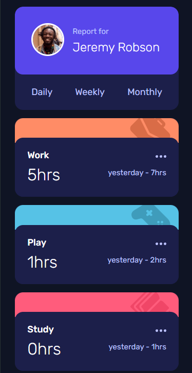
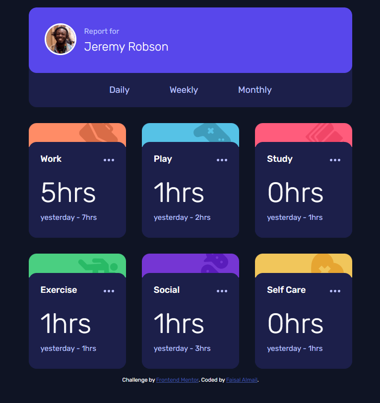
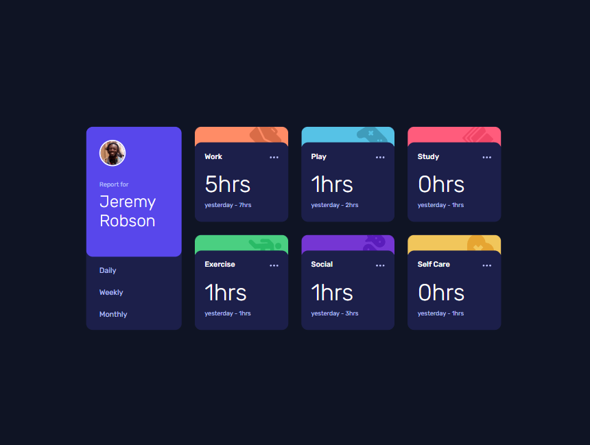
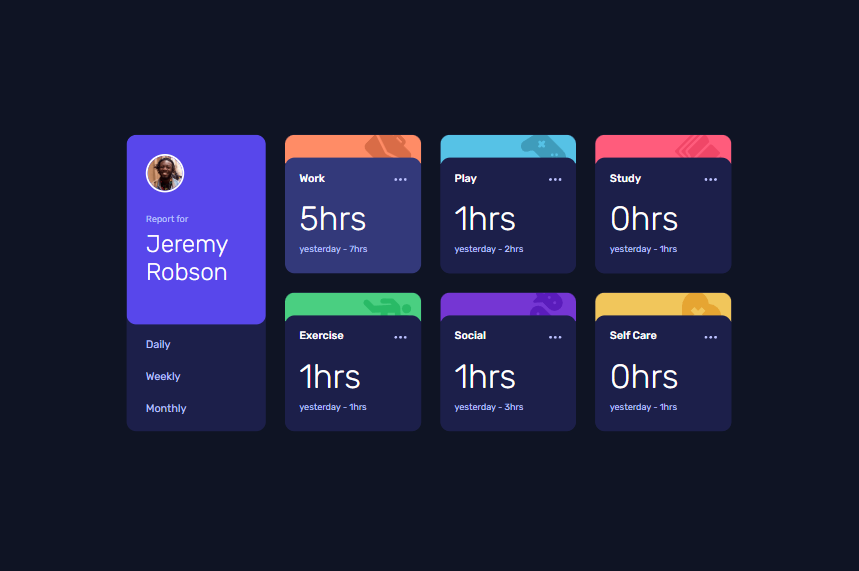

# Frontend Mentor - Time tracking dashboard solution

This is a solution to the [Time tracking dashboard challenge on Frontend Mentor](https://www.frontendmentor.io/challenges/time-tracking-dashboard-UIQ7167Jw). Frontend Mentor challenges help you improve your coding skills by building realistic projects. 

## Table of contents

- [Overview](#overview)
  - [The challenge](#the-challenge)
  - [Screenshot](#screenshot)
  - [Links](#links)
- [My process](#my-process)
  - [Built with](#built-with)
  - [What I learned](#what-i-learned)
  - [Continued development](#continued-development)
  - [Useful resources](#useful-resources)

**Note: Delete this note and update the table of contents based on what sections you keep.**

## Overview

### The challenge

Users should be able to:

- View the optimal layout for the site depending on their device's screen size
- See hover states for all interactive elements on the page
- Switch between viewing Daily, Weekly, and Monthly stats

### Screenshot

### Links

- Solution URL: [https://github.com/faisalalmail/time-tracking-dashboard](https://github.com/faisalalmail/time-tracking-dashboard)
- Live Site URL: [https://time-tracking-dashboard-mu-ten.vercel.app/](https://time-tracking-dashboard-mu-ten.vercel.app/)

## My process

### Built with

- Semantic HTML5 markup
- CSS custom properties
- Flexbox
- CSS Grid
- Mobile-first workflow

### What I learned

Challenges log for this challenge:
1. display the *report for* and *name* arranged in line with the dp.
2. 
**solution** sometimes things are complicated enough to make you think its not the easy fix you already know!

3. cropping the activity icon a little from the top and make it hide behind the next div instead of showing on top.
4. 
**solution** used negative margin on the image and applied `z-index` property to the divs. (turns out later in the project its better do put it as a background of the div instead of being an element)

*The matter of fact*, I dont think project was challenging, yes it was very new to me but I knew how to do it (in theory)**1.** I googled and read some text and learned how to process data from an array, **2.** I had the idea initially to create the cards as a loop for each item in the array instead of hard coding each card (how to do it is what I am proud to learn). **3** I call this the first project where a CSS grid is in action.

Overall, I would say I am very proud for completing this challenge for one reason *I am glad I spent this time focused on something that I loved doing*

### Continued development

Looking forward for the next challenge

### Useful resources

- [css grid generator](https://cssgrid-generator.netlify.app/) - This tool has made my work with grids much easier

